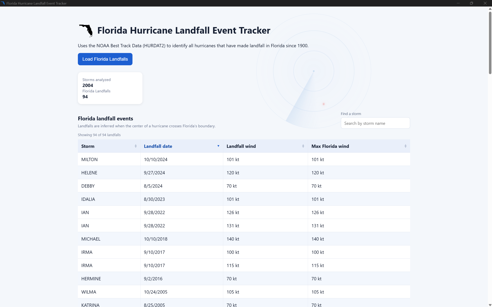

# Florida Hurricane Landfall Event Tracker

A desktop application for identifying hurricanes that made landfall in Florida using NOAA HURDAT2 track data.



## Purpose

The application parses HURDAT2 storm records, identifies inferred Florida hurricane landfalls from 1900 onward, and presents the results in a desktop interface. Each result includes the storm name, inferred landfall date, estimated landfall wind, and the highest qualifying hurricane wind found while the storm remains over Florida.

## Current Scope

- Parse Atlantic HURDAT2 storm headers and track observations.
- Process events occurring in or after 1900.
- Infer water-to-Florida landfalls from storm-track geometry without using HURDAT2's landfall indicator.
- Preserve multiple Florida landfalls from the same storm as separate events.
- Return summary counts and event details through an ASP.NET Core API.
- Display the report in an Electron desktop interface with loading, error, summary, and table states.

## How It Works

1. `HurdatParser` reads the HURDAT2 file into `Storm` and `TrackPoint` objects.
2. `FloridaBoundaryLoader` loads the Census Florida GeoJSON boundary.
3. `FloridaLandfallDetector` examines consecutive track points, finds exact or near-coast Florida crossings, distinguishes coastal approaches from Alabama/Georgia land entries, and estimates the landfall time and wind.
4. `LandfallAnalysisService` coordinates the pipeline and caches the generated report for later requests.
5. The ASP.NET Core API exposes the report at `GET /api/landfalls`.
6. The Electron renderer fetches the report and displays the results.

## Landfall Rule

The HURDAT2 `L` landfall indicator is intentionally not used. A landfall is inferred when:

- the starting track point is outside Florida;
- the segment crosses Florida or passes within the 0.02-degree tolerance used for rounded coordinates and small islands;
- the point immediately before the crossing is not on Alabama or Georgia land; and
- the surrounding observations establish hurricane status at the crossing.

Events before 1900 are excluded. Multiple crossings by the same storm remain separate report entries. Tolerance-only crossings within 12 hours of an exact crossing are treated as the same event.
The landfall wind is the primary value. The detector also scans later observations while the storm remains over Florida and classified as a hurricane, so a higher inland wind can be reported separately when present.

## Design Decisions

- When both surrounding observations are `HU`, wind is linearly interpolated at the crossing. When status changes between observations, the exact transition time is unknown, so the bracketing `HU` observation supplies the hurricane-strength landfall estimate instead of interpolating it below 64 knots.
- Alabama and Georgia geometry distinguishes a coastal Florida landfall from a storm that first made landfall in another state and later crossed into Florida over land.
- A 0.02-degree supplemental coastline tolerance accounts for HURDAT2's rounded coordinates and recovers small-island crossings such as the Dry Tortugas. It supplements rather than replaces exact polygon crossings.
- Landfall time is linearly interpolated because HURDAT2 normally records track points at six-hour intervals rather than at the exact coastline crossing.
- Separate entries into Florida are reported as separate landfall events because one storm can leave the state and later make another Florida landfall.
- Latitude and longitude are interpolated directly for this exercise. The short distance between neighboring track observations makes this accurate enough for identifying an inferred coastline crossing without adding a more complicated geodesic calculation.

## Expected Result

Using the included data files, the application analyzes 2,004 storms and reports 104 inferred Florida hurricane landfall events. These counts provide a quick way to confirm that the same dataset and analysis rules were used.

## Technology

- C# and ASP.NET Core for parsing, business logic, caching, and the API
- NetTopologySuite for spatial geometry operations
- TypeScript, HTML, CSS, and Electron for the desktop interface
- xUnit for automated tests
- NOAA HURDAT2 for hurricane-track data
- U.S. Census cartographic boundary data for the Florida geometry

## Data Sources

- [NOAA Atlantic HURDAT2 data](https://www.nhc.noaa.gov/data/) covering 1851–2025 and updated February 27, 2026. The included file is `Data/hurdat2-1851-2025-02272026.txt`.
- [NOAA HURDAT2 format specification](https://www.nhc.noaa.gov/data/hurdat/hurdat2-format-atl-1851-2021.pdf), which documents storm headers, track observations, status codes, coordinates, and wind fields.
- [U.S. Census Bureau 2025 cartographic state boundaries](https://www.census.gov/geographies/mapping-files/2025/geo/carto-boundary-file.html). Florida is stored in `Data/florida.geojson`; Alabama and Georgia are stored in `Data/florida-adjacent-states.geojson` to distinguish coastal landfalls from inland state entries.

## Portable Windows Download

For the easiest way to run the application, download `FloridaLandfallDetector-1.0.2-portable.exe` from the [latest GitHub Release](https://github.com/jasonmuse/riskdesk-florida-landfalls/releases/latest). The portable application requires no installation, Node.js, or .NET SDK.

## Running the Application

From the repository root, start the API:

```powershell
dotnet run --project .\RiskDesk.Api\RiskDesk.Api.csproj
```

In a second terminal, start Electron:

```powershell
cd .\RiskDesk.Desktop
npm start
```

Click **Load Florida Landfalls** in the desktop window.

## Building the Portable Windows Application

The portable build includes Electron, a self-contained ASP.NET Core API, and all three source data files in one executable. It does not require installation, Node.js, or the .NET SDK on the computer that runs it.

From the `RiskDesk.Desktop` directory, run:

```powershell
npm run make:portable
```

Close any running Electron development window before starting the portable build so it does not lock the generated Webpack files.

The finished `FloridaLandfallDetector-1.0.2-portable.exe` file is written to `RiskDesk.Desktop/dist`.

## Testing

Run the API tests from the repository root:

```powershell
dotnet test .\RiskDesk.Api.Tests\RiskDesk.Api.Tests.csproj
```

Run the Electron lint check:

```powershell
cd .\RiskDesk.Desktop
npm run lint
```

## Working Assumptions and Limitations

- Landfall time is linearly interpolated between observations surrounding the boundary crossing.
- `LandfallWindSpeedKnots` is interpolated when both observations are hurricanes and uses the hurricane-classified endpoint when status changes during the interval.
- `MaxFloridaWindSpeedKnots` is the highest qualifying hurricane wind observed after the landfall crossing while the storm remains over Florida.
- A point 0.01 degrees before the Florida crossing is checked against Alabama and Georgia. This is a planar approximation used to distinguish coastal approaches from inland entries.
- A 0.02-degree tolerance is used only to supplement exact crossings that rounded coordinates place just outside small Florida islands; supplemental events near an exact event are deduplicated.
- Historical storms may have the name `UNNAMED` in the source data.
- The current analysis loads the dataset on the first request and caches the report in memory for subsequent requests.
